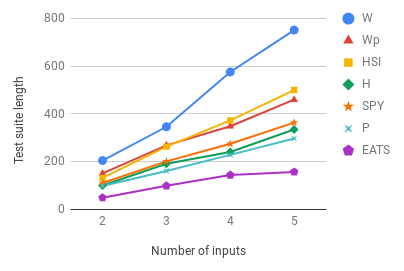

## EATS

This website aims to provide the data and charts of the experiments described in the paper "Generating reduced tests for FSMs using asearch-based testing approach" submitted to ICTAI 2019. This paper proposes the EATS method, a search-based software testing method for test suite generation from FSM. The objective of EATS is to generate test suites that represent a good trade-off between its cost and its fault coverage.

### Behaviour of EATS and literature methods varying the number of states, inputs and outputs

Markdown is a lightweight and easy-to-use syntax for styling your writing. It includes conventions for

**Afasd**


```markdown
Syntax highlighted code block

# Header 1
## Header 2
### Header 3

- Bulleted
- List

1. Numbered
2. List

**Bold** and _Italic_ and `Code` text

[Link](url) and 
```

For more details see [GitHub Flavored Markdown](https://guides.github.com/features/mastering-markdown/).

### Jekyll Themes

Your Pages site will use the layout and styles from the Jekyll theme you have selected in your [repository settings](https://github.com/marianaramada/EATS/settings). The name of this theme is saved in the Jekyll `_config.yml` configuration file.

### Support or Contact

Having trouble with Pages? Check out our [documentation](https://help.github.com/categories/github-pages-basics/) or [contact support](https://github.com/contact) and we’ll help you sort it out.

 


<a href="https://guides.github.com/features/mastering-markdown/" title="Planilha">
    
</a>
